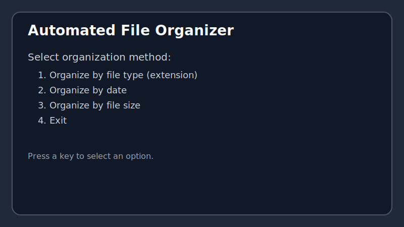
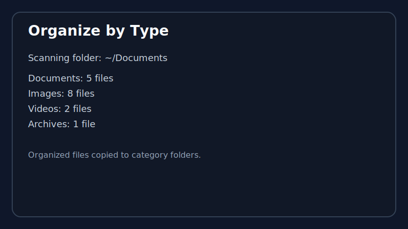
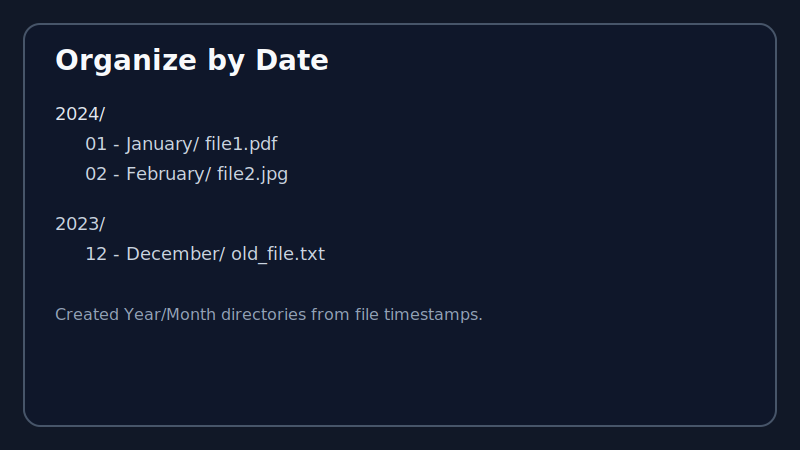

# Automated File Organizer

A flexible, configurable Python application for automatically organizing files based on various criteria including file type, date created, and file size.

## Features

✨ **Multiple Organization Methods**
- **By File Type**: Organize files into categories based on extensions (documents, images, videos, etc.)
- **By Date**: Create a Year/Month folder structure based on file modification dates
- **By File Size**: Categorize files into size groups (Small < 1MB, Medium 1-100MB, Large > 100MB)

🛠️ **Flexible Configuration**
- JSON-based configuration system
- Customizable file type rules
- Choose between copying or moving files
- Easy to extend with new categories

📊 **Rich Features**
- Detailed logging to track all operations
- Copy or move files (configurable)
- Handle duplicate filenames automatically
- Clean up empty directories
- Both interactive and command-line modes

## Installation

### Requirements
- Python 3.7 or higher
- No external dependencies required (uses only Python standard library)

### Setup

1. Clone or download this repository:
```bash
cd "Automated file organizer"
```

2. (Optional) Create a virtual environment:
```bash
python -m venv venv
# On Windows
venv\Scripts\activate
# On macOS/Linux
source venv/bin/activate
```

3. No additional dependencies needed - the app uses only Python standard library!

## Usage

### Interactive Mode (Easiest)

Run the application in interactive mode for a user-friendly menu:

```bash
python cli.py --interactive
```

This will present you with options to:
- Organize by file type
- Organize by date
- Organize by file size
- Clean up empty folders
- View configuration

### Command-Line Mode

#### Organize by File Type (Default)
```bash
python cli.py --organize type --path ~/Documents
```

#### Organize by Date
```bash
python cli.py --organize date --path ~/Downloads
```

#### Organize by File Size
```bash
python cli.py --organize size --path ~/Desktop
```

#### Move Files Instead of Copying
```bash
python cli.py --organize type --path ~/Documents --move
```

#### Clean Up Empty Folders
```bash
python cli.py --cleanup --path ~/Documents
```

#### Dry Run (Preview without making changes)
```bash
python cli.py --organize type --path ~/Documents --dry-run
```

#### Use Custom Configuration
```bash
python cli.py --organize type --path ~/Documents --config my_config.json
```

## Screenshots

### Interactive Mode


### Organize by File Type


### Organize by Date


### Using in Python Code

```python
from file_organizer import FileOrganizer

# Create organizer instance
organizer = FileOrganizer("config.json")

# Organize files by extension
stats = organizer.organize_files("~/Downloads")
print(f"Organized {stats['organized_files']} files")

# Organize by date
stats = organizer.organize_by_date("~/Downloads")

# Organize by size
stats = organizer.organize_by_size("~/Downloads")

# Clean up empty folders
deleted = organizer.cleanup_empty_folders("~/Downloads")
```

## Configuration

### Default Configuration Structure

The `config.json` file contains:

```json
{
  "source_directory": ".",
  "organize_by": "extension",
  "create_subdirectories": true,
  "move_files": false,
  "rules": {
    "documents": [".pdf", ".doc", ".docx", ".txt", ...],
    "images": [".jpg", ".jpeg", ".png", ...],
    "videos": [".mp4", ".mkv", ".avi", ...],
    ...
  }
}
```

### Configuration Options

| Option | Type | Description |
|--------|------|-------------|
| `source_directory` | string | Default directory to organize (default: current directory) |
| `organize_by` | string | Default organization method: "extension", "date", or "size" |
| `create_subdirectories` | boolean | Whether to create subdirectories for categories |
| `move_files` | boolean | If true, moves files; if false, copies them (default: false) |
| `rules` | object | File type categorization rules |

### Customizing File Categories

Edit `config.json` to add new categories or modify existing ones:

```json
{
  "rules": {
    "my_category": [".ext1", ".ext2", ".ext3"],
    "spreadsheets": [".xlsx", ".xls", ".csv"]
  }
}
```

## Output Structure

### Example: Organize by Type

```
Documents/
  report.pdf
  notes.txt
Images/
  photo.jpg
  screenshot.png
Videos/
  movie.mp4
```

### Example: Organize by Date

```
2024/
  01 - January/
    file1.pdf
  02 - February/
    file2.jpg
2023/
  12 - December/
    old_file.txt
```

### Example: Organize by Size

```
Small_<1MB/
  document.txt
Medium_1-100MB/
  video.mp4
Large_>100MB/
  big_file.iso
```

## Logging

All operations are logged to the `logs/` directory with timestamps. Log files contain:
- File organization operations
- Errors and exceptions
- Duplicate file handling
- Performance information

View logs:
```bash
ls logs/
```

## Command-Line Help

Get help on available commands:

```bash
python cli.py --help
```

## Examples

### Scenario 1: Organize Downloads folder by type

```bash
python cli.py --organize type --path ~/Downloads --interactive
```

### Scenario 2: Move all files from Desktop organized by date

```bash
python cli.py --organize date --path ~/Desktop --move
```

### Scenario 3: Organize and clean up

```bash
python cli.py --organize type --path ~/Documents --cleanup
```

### Scenario 4: Organize with custom configuration

```bash
python cli.py --organize type --path ~/Downloads --config custom_rules.json
```

## Troubleshooting

### Permission Denied Error
- **Solution**: Run the application with appropriate permissions or ensure the user has read/write access to the directory.

### Files Not Organizing
- **Check**: Ensure file extensions are in the configuration rules
- **Check**: Verify the source directory path is correct
- **Check**: Review logs in the `logs/` directory for detailed error messages

### Want to Restore Original Directory?
- **Safe**: By default, files are copied (not moved), so your original files remain unchanged
- **If moved**: Organize files back using the same method or manually restore from backup

## Advanced Usage

### Create Custom Configuration

```bash
python cli.py --create-default-config
```

This generates a `config.json` with all default categories that you can then customize.

### Dry Run to Preview Changes

```bash
python cli.py --organize type --path ~/Documents --dry-run
```

This shows what would happen without actually organizing files.

## Performance

- **Efficient file handling**: Uses Python's `pathlib` for cross-platform compatibility
- **Logging**: Minimal performance impact with async-like logging
- **Memory**: Processes files sequentially, minimal memory footprint
- **Speed**: Typically organizes 1000+ files in seconds

## Safety Features

✅ **Copy by Default**: Files are copied, not moved (configurable)
✅ **Duplicate Handling**: Automatically renames duplicate filenames
✅ **Error Handling**: Comprehensive error tracking and logging
✅ **Dry Run Mode**: Preview changes before applying them
✅ **Logging**: Complete audit trail of all operations

## Contributing

Feel free to:
- Report issues
- Suggest new features
- Contribute improvements
- Add new organization methods

## License

MIT License - feel free to use and modify for personal or commercial projects.

## Support

For issues or questions:
1. Check the logs in the `logs/` directory
2. Review the configuration in `config.json`
3. Try dry-run mode to preview changes
4. Refer to examples above

## Future Enhancements

Potential future features:
- [ ] GUI interface
- [ ] Watch mode (auto-organize on file changes)
- [ ] Undo functionality
- [ ] Advanced filtering options
- [ ] Regular expression support for file naming
- [ ] Integration with cloud storage services
- [ ] Scheduling support (cron-like)

---

**Last Updated**: 2024
**Version**: 1.0.0
